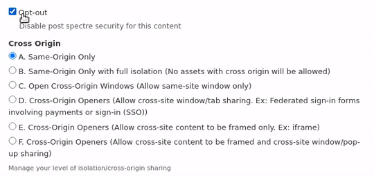
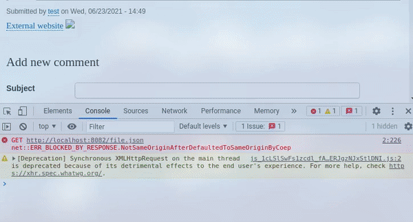
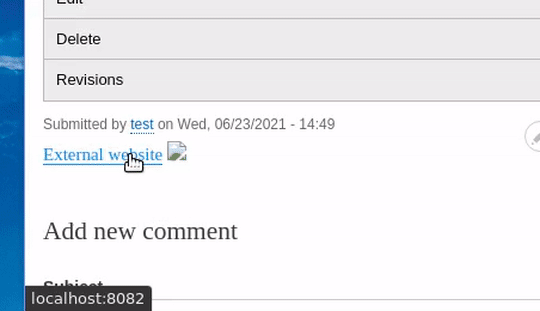

# Post Spectre Drupal Module

  

## Preface
A Drupal module that implements a variety of security mechanisms recommended by the W3C concerning defensive measures against Spectre attacks such as:
 
* Site Isolation
  * Decide when (not!) to respond to requests
  * Restrict attackers' ability to load your data as a subresource
  * Restrict attackers' ability to frame your data as a document
  * Restrict attackers' ability to obtain a handle to your window
  * Prevent MIME-type confusion attacks
  * Full isolation

## What is Post Spectre ?

The Spectre vulnerability occurs when an attacker attempts to access data in memory space. On the web, this can happen when you open a third-party website in a pop-up or new window, or when a third party displays your website in an iframe, and these sites share the same memory/context as your website without enhanced security.

To mitigate Spectre attacks, we have implemented a practical solution from the [W3C specification](https://www.w3.org/TR/post-spectre-webdev/) built into this module.

## Installation
* Download the module. [[Click here for latest version]](https://github.com/theArtechnology/post-spectre-drupal/archive/refs/tags/8.x-1.0.zip)

* Install it as you normally would by going to **`Extend > Install new module > upload`** or by extracting the contents of the zip file to your **`drupal/modules`** folder and activating it via your drupal admin dashboard. More info on how to do this here: https://www.drupal.org/docs/extending-drupal/installing-modules

* Once the module installed, click on **`Structure > Content types`** and click on **`Manage Fields`** for the content type on which you want the module to be used.

* Click on **`Add field`** & select **`Post Spectre`** from the **`Select a field type`** dropdown list. Give it a label and hit save. On the next page you'll be able to configure some default settings then you'll be good to go.

## Demo

### Features

  

### Full isolation

  

### Reverse Tabnabbing disabled

  

## Maintainers
* [theArtechnology](https://github.com/theArtechnology)
* [VEEGISHx](https://github.com/VEEGISHx) 
